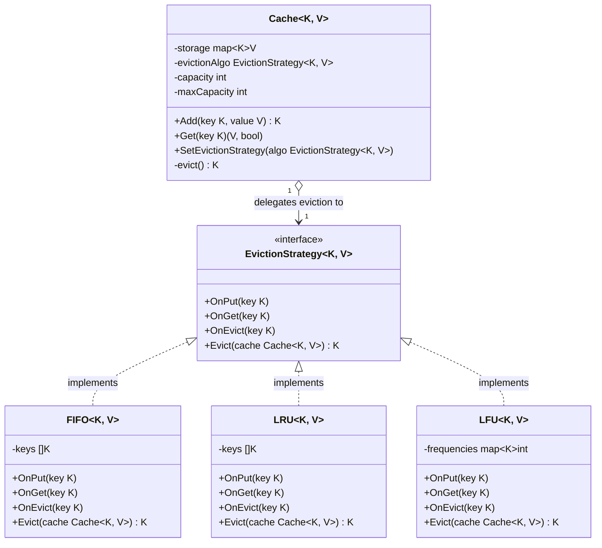

# Strategy Design Pattern (策略模式) - Go Generics

This document describes the implementation of the Strategy Design Pattern using Go Generics.

---

## Pattern Overview

The **Strategy Pattern** is a behavioral design pattern that allows defining a family of algorithms, encapsulating each one, and making them interchangeable at runtime. The algorithm varies independently from the clients that use it.

By leveraging **Go Generics**, we achieve a type-safe generic Strategy implementation where the Context (Cache) is generic over the types of keys and values, and the Strategies (Eviction algorithms) are parameterized accordingly.

---

## Project Layout

Following standard Go conventions, the documentation is located in the `docs/` directory, while code is placed in `pkg/`:

```text
design-pattern-golang/
├── docs/
│   └── behavioral/
│       └── strategy.md         # Strategy Pattern Documentation (This file)
├── pkg/
│   └── behavioral/
│       └── strategy/
│           ├── cache_strategy.go # Context (Cache) & Strategy Interface (EvictionStrategy)
│           ├── fifo.go           # Concrete Strategy: FIFO (First In, First Out)
│           ├── lru.go            # Concrete Strategy: LRU (Least Recently Used)
│           └── lfu.go            # Concrete Strategy: LFU (Least Frequently Used)
└── test/
    └── strategy_test.go        # Verification Tests
```

---

## UML Class Diagram

Below is the UML class diagram representing the generic Cache eviction system:



---

## Core Components

1. **Context (`Cache[K, V]`)**:
   Holds the generic storage mapping `K` to `V`, capacity parameters, and delegates eviction to the active `EvictionStrategy[K, V]`.
2. **Strategy (`EvictionStrategy[K, V]`)**:
   Defines callbacks for cache modifications (`OnGet`, `OnPut`, `OnEvict`) and the main `Evict` method to decide which key gets evicted.
3. **Concrete Strategies**:
   - **`FIFO`**: Evicts the oldest item inserted.
   - **`LRU`**: Evicts the least recently used/accessed item.
   - **`LFU`**: Evicts the least frequently used/accessed item.
