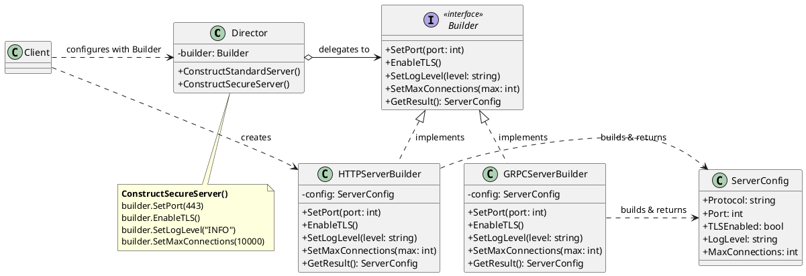

### 1. 建造者模式類別圖 (Class Diagram)

圖中展示了指導者 (Director) 如何透過抽象介面控制建構步驟，而具體的建造者 (Concrete Builder) 負責實作細節。

**角色拆解：**
*   **`Builder` (抽象建造者)：** 指定建立產品各個零件的抽象介面。
*   **`ConcreteBuilder` (具體建造者)：** 實作 `Builder` 介面，負責實際建構並組裝產品的各個零件（如 HTTP 或 gRPC 的特定設定）。它會隱藏產品的內部結構與表示方式。
*   **`Director` (指導者)：** 負責控制建構的「步驟與順序」。
*   **`Product` (產品)：** 代表正在被建構的複雜物件（在我們的例子中是 `ServerConfig`）。

---

### 2. 實戰演練題目：多協定微服務組態生成器

**背景情境**

身為 SRE 團隊的核心成員，你需要為公司內部的微服務框架開發一個統一的「伺服器組態生成器」。公司內部同時運行著對外的 HTTP 伺服器以及內部的 gRPC 伺服器。這兩種伺服器都需要設定通訊埠 (Port)、日誌等級 (Log Level)、最大連線數 (Max Connections)，以及是否啟用 TLS 加密。

**實作任務**
請使用 Golang 實作上述的 Builder Pattern，達成以下需求：

1.  **定義 Product：** 
    建立一個 `ServerConfig` 結構體，包含上述提到的所有設定屬性，並加上一個 `Protocol` 欄位（用來標示是 HTTP 還是 gRPC）。
2.  **定義 Builder 介面：** 
    設計一個 `IServerBuilder` 介面，包含 `SetPort(int)`, `EnableTLS()`, `SetLogLevel(string)`, `SetMaxConnections(int)` 以及 `GetResult() ServerConfig` 等方法。
3.  **實作 Concrete Builder：**
    *   實作 `HTTPServerBuilder`：在初始化時將 `Protocol` 預設為 "HTTP"。
    *   實作 `GRPCServerBuilder`：在初始化時將 `Protocol` 預設為 "gRPC"。
    *(提示：在 Golang 中，這些 Builder 會將自己的方法綁定在 struct 的 pointer 上，以保存建構過程的狀態。)*
4.  **實作 Director：**
    建立一個 `ServerDirector` 結構體，它包含一個 `IServerBuilder` 屬性。
    請為 Director 實作兩個方法：
    *   `ConstructStandardServer()`：建立一個一般的伺服器（Port 8080，不啟用 TLS，Log Level 為 "DEBUG"，最大連線數 1000）。
    *   `ConstructSecureServer()`：建立一個安全的生產環境伺服器（Port 8443，啟用 TLS，Log Level 為 "WARN"，最大連線數 50000）。
5.  **撰寫 `main` 函式 (Client)：**
    *   實例化一個 `HTTPServerBuilder` 並交給 `ServerDirector`。
    *   請 Director 建造一個 Secure Server，並印出結果。
    *   接著將 `GRPCServerBuilder` 交給 Director。
    *   請 Director 建造一個 Standard Server，並印出結果。

**設計思考重點**
在撰寫時請體會：我們如何透過 Director 來隔離「建構流程」的程式碼，並透過不同的 Builder 來隔離「特定協定物件的表示方式」。在未來如果我們需要新增 WebSocket 伺服器的設定，我們只需要新增一個 Builder 即可，完全不需要修改 Director 的建構邏輯！
